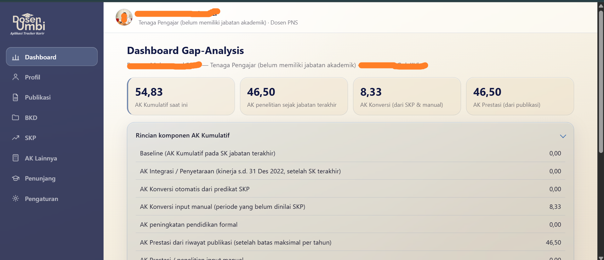
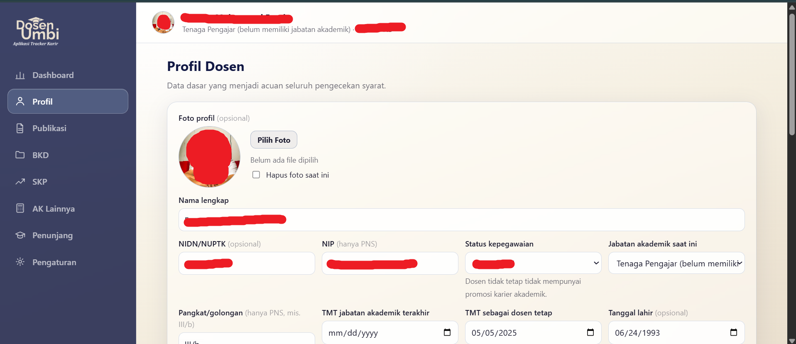
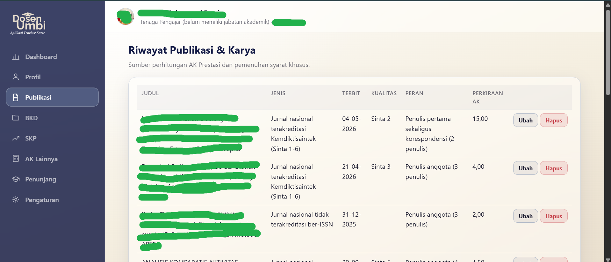

# Dosen Umbi — Aplikasi Tracker Karir Dosen

> Alat bantu perencanaan kenaikan jabatan fungsional dosen, berbasis regulasi resmi terbaru

Aplikasi web lokal untuk melacak progres kenaikan jabatan fungsional/akademik dosen (Asisten Ahli → Lektor → Lektor Kepala → Guru Besar), dibangun mengikuti ketentuan **Permendiktisaintek No. 52 Tahun 2025** tentang Profesi, Karier, dan Penghasilan Dosen, serta **Kepmendiktisaintek No. 39/M/KEP/2026** tentang Petunjuk Teknis Layanan Pengembangan Profesi dan Karier Dosen. Dibangun dengan Laravel, tema *liquid glass* dengan palet navy-cream.

---

## Preview

---

## Kenapa Dibuat

Regulasi kenaikan jabatan dosen di Indonesia berubah cukup signifikan lewat Permendiktisaintek 52/2025 dan turunannya — target Angka Kredit (AK) per jenjang, proporsi AK penelitian, syarat khusus publikasi per jenjang, hingga mekanisme reguler vs loncat jabatan, semuanya perlu dibaca dan dihitung manual dari dokumen yang cukup teknis.

Dosen Umbi lahir dari kebutuhan pribadi: mengubah pasal-pasal itu menjadi *rule engine* yang bisa dihitung otomatis, supaya progres AK dan syarat yang belum terpenuhi bisa dipantau kapan saja tanpa harus buka ulang dokumen regulasi tiap kali.

---

## Fitur Utama

- **Dashboard gap-analysis** — total AK terkumpul, kekurangan menuju jenjang berikutnya, dan checklist syarat per mekanisme (reguler & loncat jabatan)
- **Rule engine berbasis regulasi** — perhitungan AK Prestasi, AK Konversi (dari SKP), AK Integrasi, dan AK pendidikan formal, lengkap dengan batas maksimal per tahun sesuai tabel resmi
- **Anti hitung-dobel** — mekanisme *supersede* otomatis saat AK Konversi manual tumpang tindih dengan periode SKP yang sudah dinilai
- **Manajemen tridharma** — pencatatan publikasi, BKD per semester, SKP tahunan, AK penunjang, lengkap dengan link bukti (Google Drive, dsb.) per entri
- **Riwayat jabatan** — pelacakan SK dari jenjang ke jenjang sebagai titik nol perhitungan gap
- **PIN lock** — lapisan privasi ringan untuk pemakaian lokal
- **Pengaturan fleksibel** — seluruh ambang batas (target AK, syarat SJR/kuartil, dll.) dapat disesuaikan tanpa menyentuh kode, mengantisipasi revisi regulasi di kemudian hari

---

## Prinsip Desain: Privat per Individu, Bukan Portal Terpusat

Dosen Umbi sengaja dibangun **single-user tanpa sistem login berlapis**, dijalankan lokal di komputer masing-masing pengguna. Kalau kolega ingin memakai, alurnya adalah *clone* repositori dan menjalankan instance sendiri — bukan mengakses satu server bersama. Pendekatan ini dipilih karena data karir akademik bersifat personal, dan cara paling sederhana menjaga privasi antar kolega adalah tidak pernah menyatukan datanya dalam satu tempat.

---

## Tech Stack

- **Backend:** Laravel + MySQL
- **Frontend:** Blade, CSS murni (tanpa build step Node.js/npm)
- **Testing:** PHPUnit — mencakup skenario kenaikan reguler di semua jenjang, boundary case, gerbang eligibility, dan mekanisme anti hitung-dobel
- **Environment:** Laragon (lokal, tanpa server produksi)

---

## Status Proyek

**Aktif dipakai** untuk kebutuhan pribadi — bukan lagi sekadar prototipe. Rule engine sudah melalui pengujian otomatis untuk mekanisme kenaikan reguler di seluruh jenjang, termasuk kasus tepat di ambang batas.

Belum digarap: mekanisme loncat jabatan secara menyeluruh (kasusnya jarang terjadi di praktik, sengaja diprioritaskan lebih rendah), dan verifikasi resmi ke pihak Kemdiktisaintek untuk poin-poin regulasi yang teksnya ambigu (didokumentasikan sebagai *default operasional* di aplikasi).

---

## Kontak

Tertarik diskusi atau kolaborasi? Hubungi saya melalui email: **fawwazmf24@gmail.com**

Tulisan lain seputar kimia, riset, dan hal-hal yang sedang saya pelajari: [fawwazmf.com](https://fawwazmf.com)
